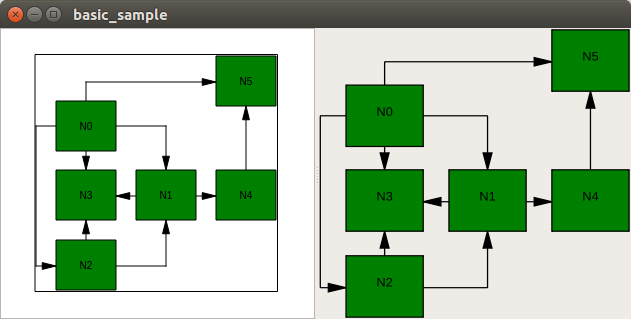

# ogdf-qt-intro
Rendering OGDF in Qt document/view architecture

To the left, rendering by OgdfScene (WIP, more primitives need to be handled) in OgdfView.
To the right, rendering by ogdf::GraphIO::drawSVG in QSvgWidget.
